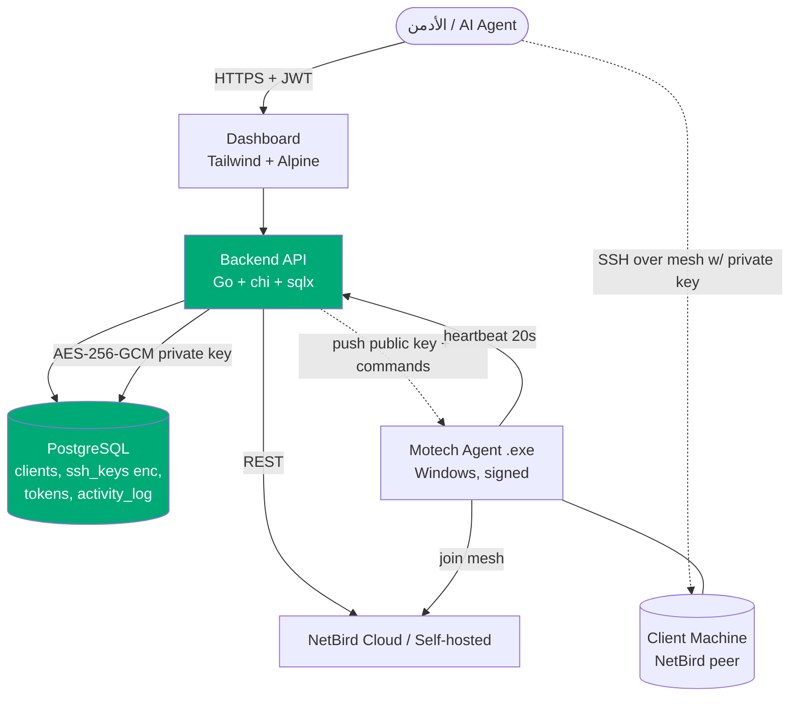

# Motech Platform — نظام إدارة الوصول الآمن عن بُعد

**Secure Remote Access Management System** for centrally managing SSH/mesh access to remote Windows client machines.

نظام مركزي لإدارة الوصول الآمن (SSH عبر شبكة NetBird mesh) إلى أجهزة العملاء/الفروع عن بُعد — مصمّم للتوسّع من 3 عملاء إلى 1000+.

---

## 🧩 المكونات (Components)

| Component | Tech | Path | Description |
|-----------|------|------|-------------|
| **Backend API** | Go + chi + sqlx | `backend/` | المنطق المركزي، DB، تكامل NetBird، مصادقة JWT |
| **Dashboard** | HTML + Tailwind + Alpine.js | `dashboard/` | لوحة تحكم الأدمن (تُخدَّم من Backend) |
| **Agent** | Go (Windows .exe) | `agent/` | يُثبَّت على جهاز العميل، يربط NetBird، heartbeat |
| **Database** | PostgreSQL 16 | — | يُوصَل عبر `DATABASE_URL` فقط (قابل للنقل) |
| **Mesh/VPN** | NetBird (Cloud → Self-hosted) | — | عبر `NETBIRD_API_URL` (قابل للتبديل) |

---

## 🏗️ المعمارية (Architecture)



**دورة الحياة**: الأدمن يضيف عميل → الـbackend يولّد keypair (الخاص مشفّر في DB) + token لمرة واحدة → العميل يفتح صفحة التثبيت → الوكيل ينضم لـ NetBird ويثبّت المفتاح العام المدفوع → الأدمن ينسخ معلومات الاتصال ويدخل SSH عبر الشبكة.

## ✨ المميزات (Features)

- 🔑 **Backend-owned SSH keys** — الـbackend يولّد ed25519 keypair، المفتاح الخاص مشفّر AES-256-GCM، يُسلّم للأدمن فقط.
- 🔄 **تدوير المفاتيح** — دورة confirm/ack، حذف القديم نهائياً.
- 📦 **وكيل .exe موقّع** (Authenticode) يعمل كخدمة تلقائية.
- 🌐 **NetBird mesh** قابل للتبديل (Cloud ↔ Self-hosted) بمتغير واحد.
- 🔗 **صفحة تثبيت برابط واحد** `/setup/{token}` للعملاء.
- 📋 **نسخ معلومات الاتصال الكاملة** (IP + User + Private Key + أمر SSH جاهز) — مثالي للوكلاء الأذكياء.
- 📝 **سجل نشاط كامل** لكل عملية (إنشاء/تدوير/وصول للمفتاح/تعطيل).
- 🌗 **RTL Arabic dashboard** — dark/light، responsive، SVG icons.

## 🎯 المبادئ المعمارية الأساسية (Core Principles)

1. **Portability first** — كل شيء قابل للنقل:
   - DB عبر `DATABASE_URL` فقط (PostgreSQL قياسي، لا ميزات منصّة محدّدة)
   - NetBird عبر `NETBIRD_API_URL` (تبديل Cloud ↔ Self-hosted بمتغيّر واحد)
2. **NetBird-native access** — نستغلّ NetBird ACLs/SSH بدل العبث بـ `authorized_keys` على ويندوز (أبسط وأأمن). SSH تقليدي كطبقة ثانوية اختيارية.
3. **Single Go binary** لكل من Backend والAgent — انسجام، نشر بسيط، لا اعتماديات runtime.
4. **Self-contained Auth** — JWT مكتوب يدوياً في Go (لا Supabase Auth / لا SDK خارجي).
5. **Everything documented** — كل قرار في `planning/DECISIONS.md`, كل مشكلة في `docs/TROUBLESHOOTING.md`.

---

## 📂 هيكل المشروع (Structure)

```
motech-platform/
├── backend/      # Go API server
├── dashboard/    # Admin web UI (served by backend)
├── agent/        # Windows agent (.exe)
├── docs/         # كل التوثيق التقني
├── planning/     # الخطة والتقدم والقرارات
└── README.md
```

## 🚀 Quick Start (Dev)

```bash
# 1. Backend
cd backend
cp .env.example .env   # ثم عدّل القيم
go run ./cmd/server

# 2. Dashboard → http://localhost:8080
```

تفاصيل كاملة في [`docs/SETUP.md`](docs/SETUP.md).

---

## 📚 الوثائق (Docs Index)

- [docs/ARCHITECTURE.md](docs/ARCHITECTURE.md) — البنية المعمارية + مخططات
- [docs/DATABASE.md](docs/DATABASE.md) — مخطط قاعدة البيانات
- [docs/API.md](docs/API.md) — توثيق الـ endpoints
- [docs/NETBIRD.md](docs/NETBIRD.md) — تكامل NetBird
- [docs/SECURITY.md](docs/SECURITY.md) — الأمان والتشفير
- [docs/SETUP.md](docs/SETUP.md) — دليل التثبيت
- [docs/DEPLOYMENT.md](docs/DEPLOYMENT.md) — دليل النشر
- [docs/TROUBLESHOOTING.md](docs/TROUBLESHOOTING.md) — حل المشاكل
- [docs/CHANGELOG.md](docs/CHANGELOG.md) — سجل التغييرات
- [planning/ROADMAP.md](planning/ROADMAP.md) — خارطة الطريق
- [planning/PROGRESS.md](planning/PROGRESS.md) — تقدّم العمل اليومي
- [planning/DECISIONS.md](planning/DECISIONS.md) — سجل القرارات المعمارية (ADRs)

---

## 🔒 الأمان (Security)

راجع [SECURITY.md](SECURITY.md) لسياسة الإبلاغ عن الثغرات والضوابط المطبّقة.
المفاتيح الخاصة مشفّرة AES-256-GCM، HTTPS فقط، ولا secrets في git.

## 📄 الترخيص (License)

Proprietary — ملكية خاصة لـ Al-Abbasi Soft. راجع [LICENSE](LICENSE).
