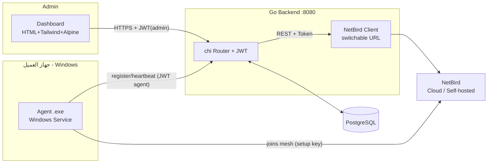
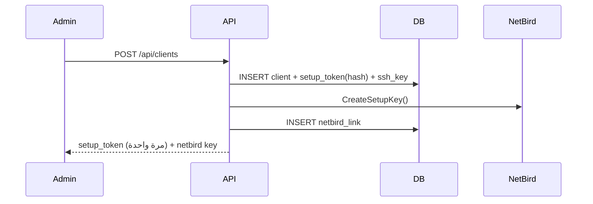
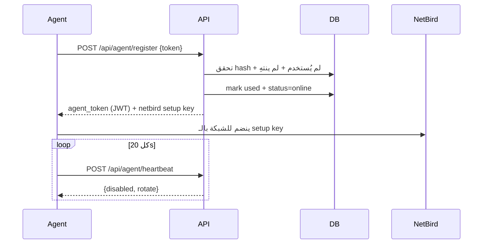

# ARCHITECTURE.md — البنية المعمارية

## المكوّنات

## التدفقات الرئيسية

### إضافة عميل

### تسجيل الـ Agent

## مبادئ التصميم
- **Portability:** DB عبر `DATABASE_URL`، NetBird عبر `NETBIRD_API_URL` — تبديل بمتغيّر واحد.
- **Stateless API:** JWT، بلا session store → يتوسّع أفقياً.
- **Poll بدل Push:** الـ Agent يسحب الأوامر كل 20s (بسيط ومتين)؛ القطع الفوري يتم عبر NetBird API مباشرة.
- **Layered access:** NetBird ACLs أساسي + SSH تقليدي ثانوي (مفتاح مشفّر في DB).

## الحزم (Go packages)
| package | المسؤولية |
|---------|-----------|
| `config` | تحميل البيئة (fail-fast على DATABASE_URL) |
| `db` | اتصال sqlx + تشغيل migrations |
| `models` | كيانات قاعدة البيانات |
| `auth` | JWT + bcrypt + middleware + AES-GCM |
| `netbird` | عميل NetBird (mock/live) |
| `handlers` | كل الـ endpoints |
